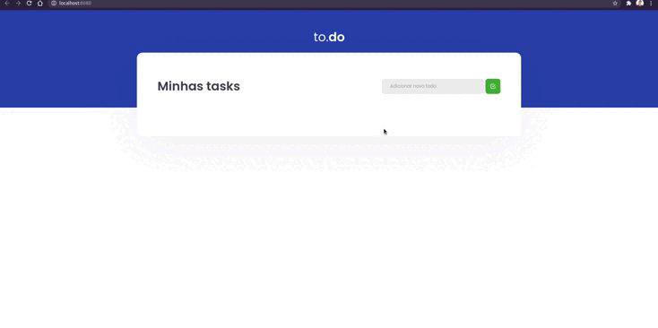

<div align="center">
    
</div>

## 🔖 Sobre

Aplicação onde o principal objetivo foi fazer uma pequena aplicação de atividades a fazer, para treinar um pouco mais sobre manipulação do estado no React.

- Adicionar uma nova tarefa
- Remover uma tarefa
- Marcar e desmarcar uma tarefa como concluída

Além dos objetivos do desafio, foi aplicado responsividade ao site e o atalho de teclado "Enter" para adicionar os to-do.

---

## 🗂 Como executar o projeto

```bash
    # Clone o repositório
    $ git clone https://github.com/renatogual/ignite-mod01-challenge01-react.git

    # Entre no diretório da aplicação
    $ cd ignite-mod01-challenge01-react

    # Instale as dependências
    $ npm install ou yarn install

    # Inicie o website
    npm start ou yarn start
```

---

Todos os detalhes do desafio podem ser vistos no link: [Desafio 1 - Conceitos do React](https://www.notion.so/Desafio-01-Conceitos-do-React-51e4099a6e2f4d4bae94f9fe75bb769d)

---
