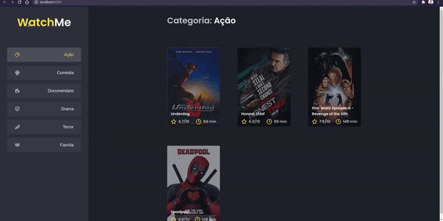

<div align="center">
    
</div>

## 🔖 Sobre

Aplicação onde o principal objetivo foi refatorar o código que já estava totalmente funcional, porém com apenas o componente App.tsx. Os componentes foram divididos em duas partes principais: sidebar e o conteúdo principal que possui o header e a listagem de filmes.

---

## 🗂 Como executar o projeto

```bash
    # Clone o repositório
    $ git clone https://github.com/renatogual/ignite-mod01-challenge02-react.git

    # Entre no diretório da aplicação
    $ cd ignite-mod01-challenge02-react

    # Instale as dependências
    $ npm install ou yarn install

    # Inicie o website
    npm start ou yarn start
```

---

Todos os detalhes do desafio podem ser vistos no link: [Desafio 2 - Componetizando a aplicação](https://www.notion.so/Desafio-02-Componentizando-a-aplica-o-b9f0f025c95b437699d0c3115f55b0f1)

---

