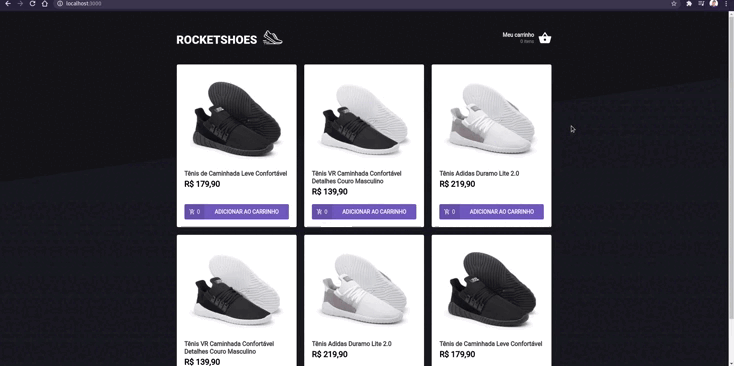

<div align="center">
    
</div>

## 🔖 Sobre

Aplicação onde o principal objetivo foi criar um hook de carrinho de compras, para implementar as funcionalidades abaixo:

- Adicionar um novo produto ao carrinho;
- Remover um produto do carrinho;
- Alterar a quantidade de um produto no carrinho;
- Cálculo dos preços sub-total e total do carrinho;
- Validação de estoque;
- Exibição de mensagens de erro;
- Entre outros.

Foi aprendido a utilização da ferramenta [JSON Server](https://github.com/typicode/json-server), como preservar dados da aplicação com localStorage API e mostrar
erros com a ferramenta [Toastify](https://www.npmjs.com/package/react-toastify). Além de praticar os conceitos de controle de estado com context api no React.

---

## 🗂 Como executar o projeto

```bash
    # Clone o repositório
    $ git clone https://github.com/renatogual/ignite-mod02-challenge01-react.git

    # Entre no diretório da aplicação
    $ cd ignite-mod02-challenge01-react

    # Instale as dependências
    $ npm install ou yarn install
    
    # Inicie o servidor da fake api
    $ npm server ou yarn server

    # Inicie o website
    npm start ou yarn start
```

---

Todos os detalhes do desafio podem ser vistos no link: [Desafio 1 - Criando um hook de carrinho de compras](https://www.notion.so/Desafio-01-Criando-um-hook-de-carrinho-de-compras-5769216778794019a83f544e79167b12)

---


